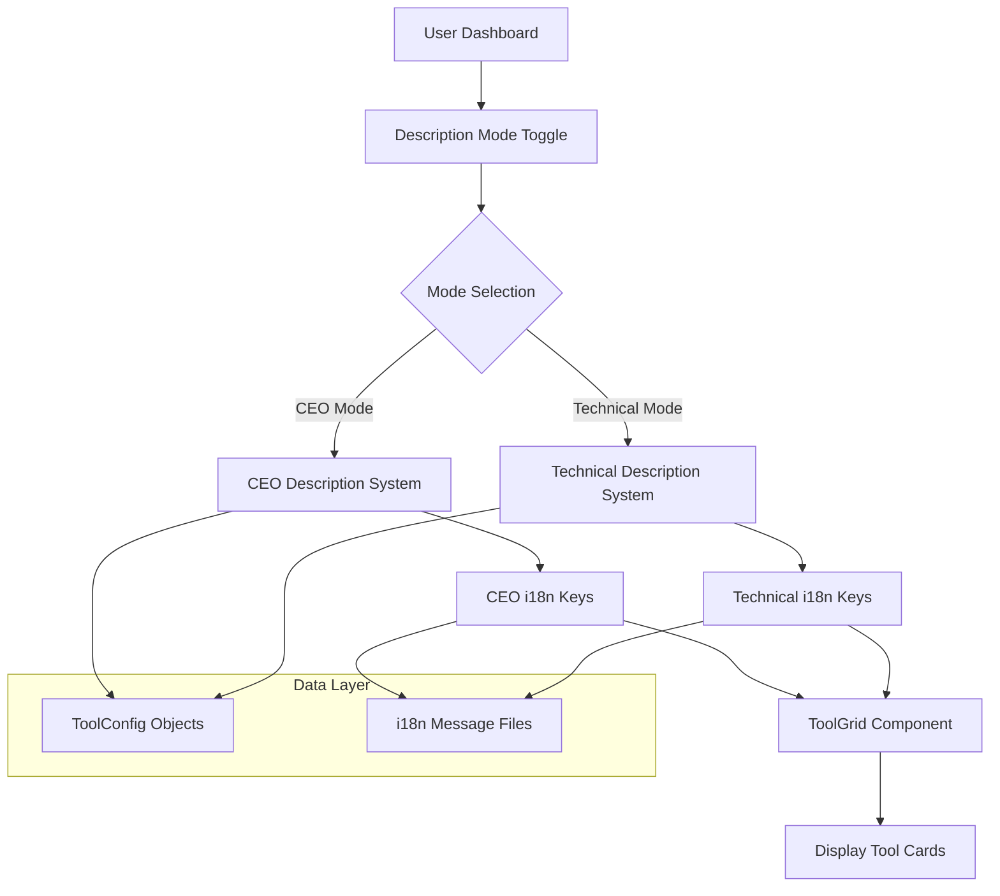

# Design Document: CEO Tool Descriptions Feature

## Overview

The CEO Tool Descriptions feature adds business-value focused descriptions to engineering calculator tools, providing executive-level users with simplified explanations that emphasize ROI, time savings, and strategic business benefits. This feature enables CalcEmpire to serve both technical engineers and business decision-makers through a toggleable display mode.

### Problem Statement

Technical engineering calculators currently display detailed technical descriptions that are optimal for engineers but overwhelming for executives. Business users need simplified explanations that answer "Why should my business care about this tool?" rather than "How does this engineering formula work?"

### Solution Approach

1. **Dual Description System**: Each tool will have both technical descriptions (existing) and CEO descriptions (new)
2. **Toggleable Display**: Users can switch between CEO and technical modes via a dashboard toggle
3. **Internationalization**: CEO descriptions available in all 17 supported languages
4. **Backward Compatibility**: Fallback to technical descriptions when CEO descriptions are unavailable
5. **Performance Optimization**: Minimal performance impact (<100ms added load time)

## Architecture

### High-Level System Diagram



### Component Architecture

```
┌─────────────────────────────────────────────────────────────┐
│                    User Interface Layer                      │
├─────────────────────────────────────────────────────────────┤
│  EngineeringDashboard ──┬── ToolGrid ──┬── ToolCard         │
│                         │              │                    │
│  DescriptionToggle ─────┘              └── DescriptionText  │
└─────────────────────────────────────────────────────────────┘
                               │
┌─────────────────────────────────────────────────────────────┐
│                    Business Logic Layer                      │
├─────────────────────────────────────────────────────────────┤
│  DescriptionSelector ──┬── CEO Mode Logic                  │
│                        │                                   │
│  FallbackHandler ──────┴── Technical Mode Logic            │
└─────────────────────────────────────────────────────────────┘
                               │
┌─────────────────────────────────────────────────────────────┐
│                      Data Access Layer                       │
├─────────────────────────────────────────────────────────────┤
│  ToolConfigLoader ──┬── i18n Translator                     │
│                    │                                        │
│  UserPreference ──┴── Description Cache                    │
└─────────────────────────────────────────────────────────────┘
```

## Components and Interfaces

### 1. ToolConfig Interface Extension

**Current Interface:**

```typescript
interface ToolConfig {
  id: ToolId;
  titleKey: string; // Technical title key
  descKey: string; // Technical description key
  catKey: CategoryKey;
  icon: string;
  features?: {
    shareableUrl?: boolean;
    pdfExport?: boolean;
  };
  isPopular?: boolean;
}
```

**Extended Interface:**

```typescript
interface ToolConfig {
  id: ToolId;
  titleKey: string; // Technical title key
  descKey: string; // Technical description key
  ceoTitleKey?: string; // CEO title key (optional)
  ceoDescKey?: string; // CEO description key (optional)
  catKey: CategoryKey;
  icon: string;
  features?: {
    shareableUrl?: boolean;
    pdfExport?: boolean;
  };
  isPopular?: boolean;
}
```

### 2. Description Mode State Management

**User Preference Interface:**

```typescript
interface DescriptionPreference {
  mode: 'ceo' | 'technical';
  timestamp: Date;
  source: 'user-toggle' | 'default' | 'url-param';
}
```

**Description Selector Service:**

```typescript
class DescriptionSelector {
  // Select appropriate description based on mode and availability
  static getDescription(
    tool: ToolConfig,
    mode: 'ceo' | 'technical',
    t: TranslationFunction
  ): { title: string; description: string } {
    if (mode === 'ceo' && tool.ceoTitleKey && tool.ceoDescKey) {
      return {
        title: t(tool.ceoTitleKey),
        description: t(tool.ceoDescKey),
      };
    }

    // Fallback to technical descriptions
    return {
      title: t(tool.titleKey),
      description: t(tool.descKey),
    };
  }
}
```

### 3. Dashboard Components

**Description Toggle Component:**

```typescript
interface DescriptionToggleProps {
  currentMode: 'ceo' | 'technical';
  onModeChange: (mode: 'ceo' | 'technical') => void;
  disabled?: boolean;
}

function DescriptionToggle({
  currentMode,
  onModeChange,
  disabled = false,
}: DescriptionToggleProps) {
  // Renders a toggle switch between CEO and Technical modes
}
```

**Enhanced ToolGrid Component:**

```typescript
interface EnhancedToolGridProps {
  toolsByCategory: Record<string, SearchableTool[]>;
  descriptionMode: 'ceo' | 'technical';
}

function EnhancedToolGrid({ toolsByCategory, descriptionMode }: EnhancedToolGridProps) {
  // Uses DescriptionSelector to get appropriate descriptions
  // Displays fallback indicator when CEO descriptions unavailable
}
```

### 4. i18n Message Structure

**CEO Description Keys Format:**

```json
{
  "Dashboard": {
    "ohmTitle": "Ohm's Law Calculator",
    "ohmDesc": "Standard calculations for V = I × R.",
    "ohmCeoTitle": "Circuit Analysis Efficiency Tool",
    "ohmCeoDesc": "Reduce electrical troubleshooting time by 70% with instant circuit analysis. Save engineering hours on complex system diagnostics."
    // ... other tools
  }
}
```

## Data Models

### 1. Tool Configuration Model

```typescript
// Enhanced ToolConfig with CEO descriptions
type EnhancedToolConfig = ToolConfig & {
  ceoTitleKey?: string;
  ceoDescKey?: string;
  hasCeoDescriptions: boolean; // Computed property
};

// Example configuration
const ENHANCED_TOOLS_CONFIG: EnhancedToolConfig[] = [
  {
    id: 'ohm',
    titleKey: 'ohmTitle',
    descKey: 'ohmDesc',
    ceoTitleKey: 'ohmCeoTitle',
    ceoDescKey: 'ohmCeoDesc',
    catKey: 'electrical',
    icon: 'Ω',
    features: { shareableUrl: true, pdfExport: true },
    isPopular: true,
    hasCeoDescriptions: true,
  },
  // ... other tools
];
```

### 2. User Preference Model

```typescript
interface UserDescriptionPreference {
  userId?: string; // Optional for anonymous users
  mode: 'ceo' | 'technical';
  lastUpdated: Date;
  source: 'toggle' | 'url' | 'default';
  sessionId: string; // For anonymous session tracking
}

// Storage strategy
interface PreferenceStorage {
  localStorage: UserDescriptionPreference; // For browser persistence
  urlParams: 'ceo' | 'technical' | null; // For shareable URLs
  serverSync?: UserDescriptionPreference; // For logged-in users
}
```

### 3. Performance Metrics Model

```typescript
interface DescriptionPerformanceMetrics {
  loadTime: number; // Time to load CEO descriptions
  cacheHitRate: number; // Cache effectiveness
  fallbackRate: number; // How often technical descriptions are used as fallback
  modeSwitchCount: number; // How often users toggle modes
}

interface ToolEngagementMetrics {
  toolId: string;
  ceoViews: number;
  technicalViews: number;
  clickThroughRate: number;
  timeSpent: number;
}
```

### 4. Content Quality Model

```typescript
interface CeoDescriptionQuality {
  toolId: string;
  hasBusinessOutcomes: boolean;
  hasQuantifiableBenefits: boolean;
  hasJargon: boolean;
  answersWhyBusinessCares: boolean;
  score: number; // 0-100 quality score
}

interface ContentValidationRules {
  minLength: number;
  maxLength: number;
  requiredKeywords: string[];
  prohibitedKeywords: string[];
  businessTermRatio: number; // Minimum % of business terms
}
```

## Correctness Properties

_A property is a characteristic or behavior that should hold true across all valid executions of a system-essentially, a formal statement about what the system should do. Properties serve as the bridge between human-readable specifications and machine-verifiable correctness guarantees._

### Property 1: Tool Configuration Structure

_For any_ tool configuration in the system, if it includes CEO descriptions, it must contain both `ceoTitleKey` and `ceoDescKey` fields with valid translation key strings.

**Validates: Requirements 1.1, 1.2**

### Property 2: Description Mode Display

_For any_ description mode ('ceo' or 'technical') and any tool configuration, the displayed title and description must come from the translation keys appropriate to that mode, falling back to technical descriptions when CEO descriptions are unavailable in CEO mode.

**Validates: Requirements 2.1, 2.2, 2.4**

### Property 3: Internationalization Coverage

_For each_ tool that has CEO descriptions, translation keys must exist in all 17 supported languages, with the system falling back to English translations when a specific language translation is missing.

**Validates: Requirements 3.1, 3.4**

### Property 4: Content Quality Standards

_For all_ CEO descriptions, the text must emphasize business outcomes over technical details, include quantifiable benefits, avoid unexplained engineering jargon, and answer "Why should a business care about this tool?"

**Validates: Requirements 4.1, 4.2, 4.3, 4.4**

### Property 5: Tool-Specific Business Value

_For each_ tool category (electrical, mechanical, civil, software, finance), the CEO description must emphasize the specific business value outlined in the requirements, such as "rapid circuit analysis saving engineering hours" for Ohm's Law Calculator.

**Validates: Requirements 6.1-6.11**

### Property 6: SEO and Structured Data Integration

_For all_ CEO descriptions, the system must include relevant keywords for business and engineering search terms and generate appropriate structured data for search engines from the CEO description content.

**Validates: Requirements 5.1, 5.2**

### Property 7: Performance Impact

_For any_ page load operation, adding CEO descriptions must increase load time by less than 100ms, and the system must maintain sub-200ms response times when serving 10,000+ concurrent users.

**Validates: Requirements 8.1, 8.2**

### Property 8: Caching Behavior

_For all_ CEO description requests, the system must cache responses with appropriate TTL settings to ensure fast delivery and reduce server load.

**Validates: Requirements 8.3**

### Property 9: Analytics Tracking

_For every_ user interaction with CEO descriptions (views, clicks, mode switches), the system must track engagement metrics and log preference data for analysis and optimization.

**Validates: Requirements 9.1, 9.2**

### Property 10: Feature Integration

_For all_ integrated features (shareable URLs, PDF exports, search, favorites, history), the CEO description system must work seamlessly, including CEO descriptions in shareable URLs, PDF executive summaries, search indexes, user preferences, and history views when in CEO mode.

**Validates: Requirements 10.1, 10.2, 10.3, 10.4, 10.5**

### Property 11: Backward Compatibility

_For all_ existing tool configurations, the enhanced system must maintain full backward compatibility, ensuring that all current functionality continues to work without modification.

**Validates: Requirements 1.4**

### Property 12: Content Management Validation

_For any_ CEO description edit operation, the system must validate content against business-focused writing guidelines and track changes with audit history.

**Validates: Requirements 7.2, 7.3**

### Property 13: A/B Testing Capability

_For any_ CEO description variation, the A/B testing system must allow testing different descriptions and measure conversion rates to optimize business value communication.

**Validates: Requirements 7.5, 9.4**

### Property 14: ROI Calculation

_For any_ set of CEO description performance metrics, the ROI calculator must estimate business value generated by description improvements based on engagement and conversion data.

**Validates: Requirements 9.5**

## Error Handling

### 1. Missing CEO Description Handling

**Scenario**: A tool configuration lacks CEO descriptions but is viewed in CEO mode
**Response**: System falls back to technical descriptions with a visual indicator (info icon or subtle badge)
**User Experience**: Users see technical description with "Business view unavailable" indicator
**Logging**: System logs missing CEO description for content gap analysis

### 2. Translation Key Errors

**Scenario**: CEO translation key exists but points to empty or malformed content
**Response**: System falls back to English CEO description, then to technical description
**Validation**: Content validation during editing prevents empty/malformed translations
**Monitoring**: Alert triggered when translation quality falls below threshold

### 3. Performance Degradation

**Scenario**: CEO description system adds >100ms to page load
**Response**: Performance monitoring alerts team, system can temporarily disable CEO descriptions
**Mitigation**: Implement aggressive caching, CDN distribution, lazy loading
**Recovery**: Automatic scaling, cache warming, performance optimization

### 4. Content Quality Violations

**Scenario**: CEO description fails content quality validation (too technical, missing business value)
**Response**: Editing interface shows validation errors, prevents publishing
**Workflow**: Content goes through marketing/technical review before publishing
**Improvement**: A/B testing identifies high-performing descriptions

### 5. User Preference Conflicts

**Scenario**: URL parameter, localStorage, and server preference conflict
**Resolution Priority**: URL param > localStorage > server default > system default
**Consistency**: System reconciles conflicts and uses most recent explicit choice
**Persistence**: Preferences saved across sessions for returning users

## Testing Strategy

### Dual Testing Approach

The testing strategy employs both unit tests and property-based tests to ensure comprehensive coverage:

1. **Unit Tests**: Verify specific examples, edge cases, and integration points
2. **Property Tests**: Verify universal properties across all inputs using generated test data

### Unit Testing Focus Areas

**Component Tests**:

- DescriptionToggle component renders correctly in both states
- ToolGrid displays appropriate descriptions based on mode
- Fallback indicators show when CEO descriptions unavailable

**Integration Tests**:

- CEO mode persists in shareable URLs
- PDF exports include CEO descriptions in executive summaries
- Search indexes CEO descriptions for business-term queries

**Edge Case Tests**:

- Tools without CEO descriptions in CEO mode
- Missing translation keys in non-English languages
- Performance under high concurrent load

### Property-Based Testing Configuration

**Library Selection**: Use `fast-check` for property-based testing in TypeScript
**Iterations**: Minimum 100 iterations per property test
**Tagging Format**: `Feature: ceo-tool-descriptions, Property {number}: {property_text}`

**Example Property Test**:

```typescript
import { fc } from 'fast-check';

describe('Property 2: Description Mode Display', () => {
  it('should display appropriate descriptions based on mode', () => {
    fc.assert(
      fc.property(
        fc.constantFrom('ceo', 'technical'),
        fc.record({
          id: fc.string(),
          titleKey: fc.string(),
          descKey: fc.string(),
          ceoTitleKey: fc.option(fc.string(), { nil: undefined }),
          ceoDescKey: fc.option(fc.string(), { nil: undefined }),
        }),
        (mode, tool) => {
          const result = DescriptionSelector.getDescription(tool, mode, mockT);
          // Verify appropriate description source used
          if (mode === 'ceo' && tool.ceoTitleKey && tool.ceoDescKey) {
            return (
              result.title === mockT(tool.ceoTitleKey) &&
              result.description === mockT(tool.ceoDescKey)
            );
          } else {
            return (
              result.title === mockT(tool.titleKey) && result.description === mockT(tool.descKey)
            );
          }
        }
      ),
      { numRuns: 100 }
    );
  });
});
```

### Performance Testing

**Load Testing**: Simulate 10,000+ concurrent users accessing CEO descriptions
**Performance Monitoring**: Track load time delta (<100ms requirement)
**Caching Validation**: Verify cache hit rates and TTL effectiveness

### Content Quality Testing

**Automated Validation**: Test CEO descriptions against business writing guidelines
**A/B Testing Framework**: Test different description variations for engagement
**SEO Validation**: Verify keyword inclusion and structured data generation

### Internationalization Testing

**Language Coverage**: Test all 17 supported languages
**Fallback Behavior**: Verify English fallback when translations missing
**RTL Support**: Test right-to-left language rendering (Arabic, Hebrew if added)

### Integration Testing

**Shareable URLs**: Verify CEO mode persists in shared links
**PDF Export**: Test CEO descriptions in executive summaries
**Analytics Integration**: Verify tracking of CEO description engagement
