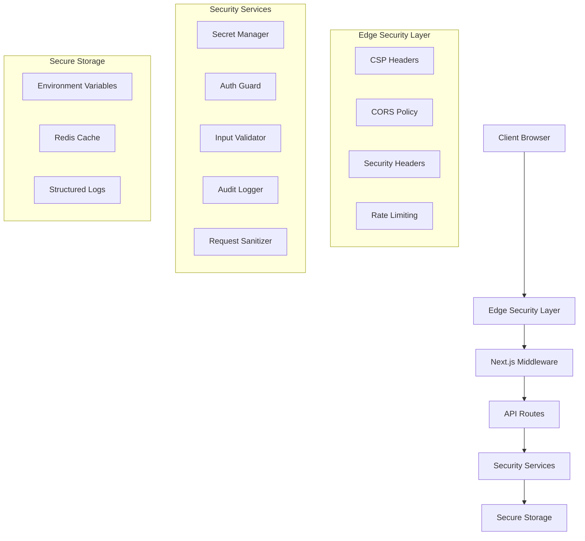
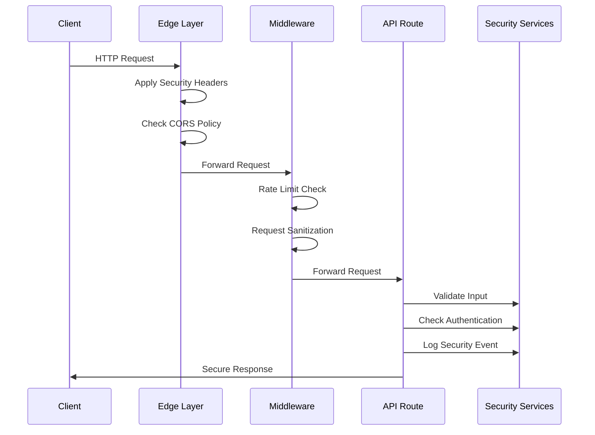

# Security Hardening Technical Design Document

## Overview

This document outlines the technical design for implementing comprehensive security hardening measures in the CalcEmpire Next.js application. The design addresses 12 critical security requirements covering secret management, Content Security Policy hardening, rate limiting, authentication enhancement, input validation, CORS configuration, privacy-enhanced monitoring, request size limiting, security headers, security monitoring, secure configuration management, and API security testing.

The security hardening feature will transform the current application from a basic security posture to an enterprise-grade security implementation. The design follows defense-in-depth principles, implementing multiple layers of security controls to protect against common web application threats including XSS, CSRF, injection attacks, DDoS, and data breaches.

### Key Security Improvements

- **Secret Management**: Transition from hardcoded API keys to secure secret management with environment-specific loading and rotation capabilities
- **CSP Hardening**: Remove unsafe directives and implement nonce/hash-based policies for strict content security
- **Rate Limiting**: Implement comprehensive rate limiting with sliding window algorithms and progressive penalties
- **Enhanced Authentication**: Replace simple string comparison with cryptographic JWT validation and RBAC
- **Input Validation**: Comprehensive validation and sanitization for all user inputs using strict schemas
- **Security Headers**: Full implementation of OWASP-recommended security headers with browser protection
- **Monitoring**: Privacy-enhanced security monitoring with structured logging and incident response

## Architecture

### Security Layer Architecture

The security hardening implementation follows a layered architecture approach:



### Security Service Integration

The security services are designed as composable middleware components that can be applied at different layers:

1. **Edge Layer**: CSP, CORS, and basic security headers applied via Next.js configuration
2. **Middleware Layer**: Rate limiting, request sanitization, and authentication checks
3. **API Layer**: Input validation, authorization, and audit logging
4. **Service Layer**: Secret management, session management, and security monitoring

### Request Flow Security Pipeline



## Components and Interfaces

### Core Security Services

#### 1. Security Manager (`SecurityManager`)

Central orchestrator for all security services.

```typescript
interface SecurityManager {
  initialize(): Promise<void>;
  validateConfiguration(): SecurityValidationResult;
  getSecurityStatus(): SecurityStatus;
  handleSecurityIncident(incident: SecurityIncident): Promise<void>;
}

interface SecurityStatus {
  secretsLoaded: boolean;
  rateLimitingActive: boolean;
  cspEnabled: boolean;
  authenticationActive: boolean;
  monitoringActive: boolean;
}
```

#### 2. Secret Manager (`SecretManager`)

Manages API keys and sensitive configuration with rotation capabilities.

```typescript
interface SecretManager {
  loadSecrets(environment: Environment): Promise<SecretStore>;
  getSecret(key: string): Promise<string | null>;
  rotateSecret(key: string): Promise<void>;
  validateSecrets(): Promise<ValidationResult>;
  auditSecretAccess(key: string, accessor: string): void;
}

interface SecretStore {
  apiKeys: Record<string, string>;
  databaseUrls: Record<string, string>;
  authTokens: Record<string, string>;
  encryptionKeys: Record<string, string>;
}

enum Environment {
  DEVELOPMENT = 'development',
  STAGING = 'staging',
  PRODUCTION = 'production',
}
```

#### 3. Rate Limiter (`RateLimiter`)

Implements sliding window rate limiting with progressive penalties.

```typescript
interface RateLimiter {
  checkLimit(identifier: string, endpoint: string): Promise<RateLimitResult>;
  incrementCounter(identifier: string, endpoint: string): Promise<void>;
  applyPenalty(identifier: string, violation: RateLimitViolation): Promise<void>;
  getStats(): RateLimitStats;
}

interface RateLimitResult {
  allowed: boolean;
  remaining: number;
  resetTime: Date;
  retryAfter?: number;
}

interface RateLimitConfig {
  windowSizeMs: number;
  maxRequests: number;
  burstLimit: number;
  penaltyMultiplier: number;
}
```

#### 4. Input Validator (`InputValidator`)

Comprehensive input validation and sanitization service.

```typescript
interface InputValidator {
  validateApiRequest(request: ApiRequest): ValidationResult;
  sanitizeInput(input: unknown, schema: ValidationSchema): SanitizedInput;
  validateFileUpload(file: FileUpload): FileValidationResult;
  checkPayloadSize(payload: unknown): SizeValidationResult;
}

interface ValidationResult {
  isValid: boolean;
  errors: ValidationError[];
  sanitizedData?: unknown;
}

interface ValidationSchema {
  type: 'object' | 'array' | 'string' | 'number' | 'boolean';
  properties?: Record<string, ValidationSchema>;
  maxLength?: number;
  pattern?: RegExp;
  required?: boolean;
}
```

#### 5. Auth Guard (`AuthGuard`)

Enhanced authentication and authorization with JWT validation and RBAC.

```typescript
interface AuthGuard {
  validateToken(token: string): Promise<TokenValidationResult>;
  checkPermission(user: User, resource: string, action: string): Promise<boolean>;
  createSession(user: User): Promise<Session>;
  revokeSession(sessionId: string): Promise<void>;
  handleFailedAuth(attempt: AuthAttempt): Promise<void>;
}

interface TokenValidationResult {
  isValid: boolean;
  user?: User;
  claims?: JWTClaims;
  expiresAt?: Date;
}

interface User {
  id: string;
  email: string;
  roles: Role[];
  permissions: Permission[];
}

interface Role {
  name: string;
  permissions: Permission[];
}
```

#### 6. CSP Manager (`CSPManager`)

Manages Content Security Policy with nonce and hash support.

```typescript
interface CSPManager {
  generateNonce(): string;
  calculateHash(content: string): string;
  buildCSPHeader(context: CSPContext): string;
  reportViolation(violation: CSPViolation): void;
  testCSPPolicy(policy: CSPPolicy): Promise<CSPTestResult>;
}

interface CSPPolicy {
  defaultSrc: string[];
  scriptSrc: string[];
  styleSrc: string[];
  imgSrc: string[];
  connectSrc: string[];
  fontSrc: string[];
  reportUri?: string;
}
```

#### 7. CORS Manager (`CORSManager`)

Controls cross-origin resource sharing with allowlist validation.

```typescript
interface CORSManager {
  validateOrigin(origin: string, endpoint: string): boolean;
  buildCORSHeaders(request: Request): CORSHeaders;
  handlePreflightRequest(request: Request): Response;
  logCORSAttempt(origin: string, allowed: boolean): void;
}

interface CORSHeaders {
  'Access-Control-Allow-Origin'?: string;
  'Access-Control-Allow-Methods'?: string;
  'Access-Control-Allow-Headers'?: string;
  'Access-Control-Max-Age'?: string;
}
```

#### 8. Audit Logger (`AuditLogger`)

Privacy-enhanced security event logging with structured data.

```typescript
interface AuditLogger {
  logSecurityEvent(event: SecurityEvent): Promise<void>;
  logAuthEvent(event: AuthEvent): Promise<void>;
  logRateLimitViolation(event: RateLimitEvent): Promise<void>;
  maskSensitiveData(data: unknown): unknown;
  generateSecurityReport(timeRange: TimeRange): Promise<SecurityReport>;
}

interface SecurityEvent {
  id: string;
  timestamp: Date;
  type: SecurityEventType;
  severity: SecuritySeverity;
  source: string;
  details: Record<string, unknown>;
  userId?: string;
}

enum SecurityEventType {
  AUTH_FAILURE = 'auth_failure',
  RATE_LIMIT_EXCEEDED = 'rate_limit_exceeded',
  CSP_VIOLATION = 'csp_violation',
  INVALID_INPUT = 'invalid_input',
  UNAUTHORIZED_ACCESS = 'unauthorized_access',
}
```

#### 9. Request Sanitizer (`RequestSanitizer`)

Validates and limits request payloads to prevent abuse.

```typescript
interface RequestSanitizer {
  validateRequestSize(request: Request): SizeValidationResult;
  sanitizePayload(payload: unknown): SanitizedPayload;
  checkParameterCount(params: Record<string, unknown>): ParameterValidationResult;
  validateTimeout(request: Request): TimeoutValidationResult;
}

interface SizeValidationResult {
  isValid: boolean;
  actualSize: number;
  maxAllowed: number;
  exceedsLimit: boolean;
}
```

### Security Configuration

#### Environment-Specific Security Settings

```typescript
interface SecurityConfig {
  environment: Environment;
  secrets: SecretConfig;
  rateLimiting: RateLimitConfig;
  csp: CSPConfig;
  cors: CORSConfig;
  monitoring: MonitoringConfig;
  validation: ValidationConfig;
}

interface SecretConfig {
  provider: 'env' | 'vault' | 'aws-secrets';
  rotationEnabled: boolean;
  rotationIntervalDays: number;
  requiredSecrets: string[];
}

interface MonitoringConfig {
  enabledEvents: SecurityEventType[];
  logLevel: 'debug' | 'info' | 'warn' | 'error';
  retentionDays: number;
  alertingEnabled: boolean;
  privacyMode: boolean;
}
```

## Data Models

### Security Event Models

```typescript
interface SecurityIncident {
  id: string;
  timestamp: Date;
  type: IncidentType;
  severity: IncidentSeverity;
  description: string;
  affectedResources: string[];
  mitigationActions: string[];
  status: IncidentStatus;
}

enum IncidentType {
  BRUTE_FORCE_ATTACK = 'brute_force_attack',
  DDoS_ATTEMPT = 'ddos_attempt',
  INJECTION_ATTEMPT = 'injection_attempt',
  UNAUTHORIZED_ACCESS = 'unauthorized_access',
  DATA_BREACH_ATTEMPT = 'data_breach_attempt',
}

enum IncidentSeverity {
  LOW = 'low',
  MEDIUM = 'medium',
  HIGH = 'high',
  CRITICAL = 'critical',
}
```

### Authentication Models

```typescript
interface Session {
  id: string;
  userId: string;
  createdAt: Date;
  expiresAt: Date;
  ipAddress: string;
  userAgent: string;
  isActive: boolean;
  lastActivity: Date;
}

interface AuthAttempt {
  id: string;
  timestamp: Date;
  email: string;
  ipAddress: string;
  userAgent: string;
  success: boolean;
  failureReason?: string;
}

interface JWTClaims {
  sub: string; // user ID
  email: string;
  roles: string[];
  permissions: string[];
  iat: number; // issued at
  exp: number; // expires at
  aud: string; // audience
  iss: string; // issuer
}
```

### Rate Limiting Models

```typescript
interface RateLimitBucket {
  identifier: string;
  endpoint: string;
  requests: number;
  windowStart: Date;
  penaltyMultiplier: number;
  lastViolation?: Date;
}

interface RateLimitViolation {
  identifier: string;
  endpoint: string;
  timestamp: Date;
  requestCount: number;
  limit: number;
  penaltyApplied: number;
}
```

## Implementation Architecture

### Middleware Integration

The security services will be integrated into Next.js middleware for optimal performance:

```typescript
// src/middleware.ts
import { NextRequest, NextResponse } from 'next/server';
import { SecurityManager } from '@/lib/security/SecurityManager';
import { RateLimiter } from '@/lib/security/RateLimiter';
import { RequestSanitizer } from '@/lib/security/RequestSanitizer';

export async function middleware(request: NextRequest) {
  const securityManager = SecurityManager.getInstance();

  // Rate limiting check
  const rateLimitResult = await securityManager.checkRateLimit(request);
  if (!rateLimitResult.allowed) {
    return new NextResponse('Rate limit exceeded', {
      status: 429,
      headers: {
        'Retry-After': rateLimitResult.retryAfter?.toString() || '60',
      },
    });
  }

  // Request sanitization
  const sanitizationResult = await securityManager.sanitizeRequest(request);
  if (!sanitizationResult.isValid) {
    return new NextResponse('Invalid request', { status: 400 });
  }

  // Continue with next-intl middleware
  return createIntlMiddleware(routing)(request);
}
```

### API Route Security Integration

Security services will be integrated into API routes through higher-order functions:

```typescript
// src/lib/security/withSecurity.ts
export function withSecurity(handler: ApiHandler, options: SecurityOptions = {}) {
  return async (req: NextRequest, context: RouteContext) => {
    const securityManager = SecurityManager.getInstance();

    // Input validation
    if (options.validateInput) {
      const validationResult = await securityManager.validateInput(req, options.schema);
      if (!validationResult.isValid) {
        return NextResponse.json({ error: 'Invalid input' }, { status: 400 });
      }
    }

    // Authentication check
    if (options.requireAuth) {
      const authResult = await securityManager.authenticate(req);
      if (!authResult.isAuthenticated) {
        return NextResponse.json({ error: 'Unauthorized' }, { status: 401 });
      }
      context.user = authResult.user;
    }

    // Authorization check
    if (options.requiredPermissions) {
      const authzResult = await securityManager.authorize(
        context.user,
        options.requiredPermissions
      );
      if (!authzResult.isAuthorized) {
        return NextResponse.json({ error: 'Forbidden' }, { status: 403 });
      }
    }

    // Execute handler with security context
    const response = await handler(req, context);

    // Log security event
    await securityManager.logApiAccess(req, response, context);

    return response;
  };
}
```

### Security Service Implementation Structure

```
src/lib/security/
├── SecurityManager.ts          # Central security orchestrator
├── SecretManager.ts           # Secret management service
├── RateLimiter.ts            # Rate limiting implementation
├── InputValidator.ts         # Input validation service
├── AuthGuard.ts              # Authentication & authorization
├── CSPManager.ts             # Content Security Policy
├── CORSManager.ts            # CORS management
├── AuditLogger.ts            # Security event logging
├── RequestSanitizer.ts       # Request sanitization
├── SessionManager.ts         # Session management
├── config/
│   ├── security.config.ts    # Security configuration
│   ├── rate-limits.config.ts # Rate limiting rules
│   └── csp.config.ts         # CSP policies
├── middleware/
│   ├── rateLimitMiddleware.ts
│   ├── authMiddleware.ts
│   └── validationMiddleware.ts
└── utils/
    ├── crypto.ts             # Cryptographic utilities
    ├── validation.ts         # Validation helpers
    └── monitoring.ts         # Monitoring utilities
```

## Correctness Properties

_A property is a characteristic or behavior that should hold true across all valid executions of a system-essentially, a formal statement about what the system should do. Properties serve as the bridge between human-readable specifications and machine-verifiable correctness guarantees._

After analyzing the acceptance criteria, I identified several areas where properties can be consolidated to eliminate redundancy while maintaining comprehensive coverage:

**Property Reflection:**

- Secret management properties (1.1-1.7) can be consolidated around secret loading, validation, and audit behaviors
- CSP properties (2.1-2.7) can be grouped around policy generation, violation handling, and validation
- Rate limiting properties (3.1-3.8) can be combined around limit enforcement, response handling, and violation tracking
- Authentication properties (4.1-4.8) can be unified around token validation, session management, and security measures
- Input validation properties (5.1-5.8) can be consolidated around validation, sanitization, and error handling
- CORS properties (6.1-6.7) can be grouped around origin validation and policy enforcement
- Logging properties (7.1-7.7, 10.1-10.7) can be combined around privacy protection, structured logging, and monitoring
- Request sanitization properties (8.1-8.7) can be unified around size limits and payload validation
- Security headers properties (9.1-9.7) can be consolidated around header configuration and validation
- Configuration properties (11.1-11.7) can be grouped around validation and environment management
- Security testing properties (12.1-12.7) can be combined around automated testing and validation

### Property 1: Secret Management Security

_For any_ environment and secret configuration, the Secret Manager should load secrets from the appropriate source, validate all required secrets are present, and log access attempts while preventing application startup when required secrets are missing.

**Validates: Requirements 1.1, 1.2, 1.3, 1.4, 1.5, 1.7**

### Property 2: Secret Rotation Capability

_For any_ API key managed by the Secret Manager, the rotation function should successfully update the secret and maintain system functionality without service interruption.

**Validates: Requirements 1.6**

### Property 3: CSP Policy Generation and Enforcement

_For any_ application context, the CSP Manager should generate policies without unsafe directives, include appropriate nonces and hashes, and log violations while blocking unauthorized resources.

**Validates: Requirements 2.1, 2.2, 2.3, 2.4, 2.6, 2.7**

### Property 4: CSP Testing and Validation

_For any_ CSP policy configuration, the CSP Manager should support report-only mode for testing and validate policy effectiveness without blocking legitimate resources.

**Validates: Requirements 2.5**

### Property 5: Rate Limiting Enforcement

_For any_ API endpoint and client identifier, the Rate Limiter should enforce appropriate limits using sliding window algorithms, return HTTP 429 with retry-after headers when exceeded, and apply progressive penalties for repeated violations.

**Validates: Requirements 3.1, 3.2, 3.3, 3.4, 3.5, 3.6, 3.8**

### Property 6: Rate Limit Monitoring

_For any_ rate limit violation, the Rate Limiter should log the event with appropriate details for security monitoring and analysis.

**Validates: Requirements 3.7**

### Property 7: Authentication Token Validation

_For any_ authentication request, the Auth Guard should use cryptographic token validation instead of string comparison, validate JWT claims and expiration, and implement progressive delays for failed attempts.

**Validates: Requirements 4.1, 4.3, 4.7, 4.8**

### Property 8: Authorization and Session Management

_For any_ authenticated user and protected resource, the Auth Guard should enforce RBAC policies, manage session timeouts with automatic logout, and implement account lockout after failed attempts.

**Validates: Requirements 4.2, 4.4, 4.6**

### Property 9: Authentication Event Logging

_For any_ authentication or authorization event, the Auth Guard should log the attempt with appropriate details for security monitoring and audit purposes.

**Validates: Requirements 4.5**

### Property 10: Input Validation and Sanitization

_For any_ API request or user input, the Input Validator should validate against strict schemas, sanitize strings to prevent injection, perform type checking, and validate ranges and constraints.

**Validates: Requirements 5.1, 5.2, 5.4, 5.5**

### Property 11: Input Validation Error Handling

_For any_ invalid input, the Input Validator should return descriptive error messages and log validation failures for security monitoring.

**Validates: Requirements 5.3, 5.8**

### Property 12: File Upload and Payload Validation

_For any_ file upload or request payload, the Input Validator should validate file types and sizes, prevent oversized payloads, and protect against parameter pollution.

**Validates: Requirements 5.6, 5.7**

### Property 13: CORS Origin Validation and Policy Enforcement

_For any_ cross-origin request, the CORS Manager should validate origins against allowlists, enforce endpoint-specific policies, handle preflight requests, and implement different policies for public and private endpoints.

**Validates: Requirements 6.1, 6.2, 6.3, 6.4, 6.6**

### Property 14: CORS Security Monitoring

_For any_ cross-origin request attempt, the CORS Manager should log the request and block unauthorized origins while logging the security event.

**Validates: Requirements 6.5, 6.7**

### Property 15: Privacy-Enhanced Security Logging

_For any_ security event or error, the Audit Logger should mask sensitive information, sanitize error messages, ensure PII is never logged in production, and implement environment-specific logging levels.

**Validates: Requirements 7.1, 7.3, 7.5, 7.7**

### Property 16: Structured Security Event Management

_For any_ security event, the Audit Logger should use structured logging for correlation, implement log retention policies, and reduce session replay sampling for privacy protection.

**Validates: Requirements 7.2, 7.4, 7.6**

### Property 17: Request Size and Payload Protection

_For any_ incoming request, the Request Sanitizer should enforce maximum size limits, validate JSON structure and depth, implement parameter count limits, and enforce timeout limits.

**Validates: Requirements 8.1, 8.2, 8.4, 8.6**

### Property 18: Request Sanitization Error Handling

_For any_ oversized or invalid request, the Request Sanitizer should reject it with appropriate error messages and log the attempt for security monitoring.

**Validates: Requirements 8.3, 8.7**

### Property 19: File Upload Request Validation

_For any_ file upload request, the Request Sanitizer should validate file sizes and types according to security policies.

**Validates: Requirements 8.5**

### Property 20: Security Headers Configuration

_For any_ HTTP response, the Security Manager should include HSTS headers with appropriate max-age, configure X-Frame-Options for clickjacking protection, implement Permissions-Policy and Referrer-Policy headers, and set cross-origin policies.

**Validates: Requirements 9.1, 9.2, 9.3, 9.4, 9.5**

### Property 21: Security Headers Validation

_For any_ security header configuration, the Security Manager should validate effectiveness across different browsers and implement testing and validation mechanisms.

**Validates: Requirements 9.6, 9.7**

### Property 22: Real-Time Security Monitoring

_For any_ security event, the Audit Logger should implement real-time monitoring, configure alerting for suspicious patterns, trigger incident response workflows, and implement automated responses for common attack patterns.

**Validates: Requirements 10.1, 10.2, 10.3, 10.6**

### Property 23: Security Metrics and Reporting

_For any_ security monitoring period, the Audit Logger should collect metrics, provide dashboards, correlate events across components, and generate compliance reports.

**Validates: Requirements 10.4, 10.5, 10.7**

### Property 24: Security Configuration Management

_For any_ security configuration, the Security Manager should validate settings for correctness, ensure environment-appropriate configurations, validate security implications of changes, and detect configuration drift.

**Validates: Requirements 11.1, 11.2, 11.3, 11.4**

### Property 25: Security Configuration Documentation and Testing

_For any_ security configuration option, the Security Manager should maintain documentation, implement automated testing, and ensure secure defaults.

**Validates: Requirements 11.5, 11.6, 11.7**

### Property 26: Automated Security Testing

_For any_ API endpoint, the Security Manager should implement automated security testing, validate rate limiting effectiveness, verify input validation, and test authentication and authorization mechanisms.

**Validates: Requirements 12.1, 12.2, 12.3, 12.4**

### Property 27: Security Testing Validation and Reporting

_For any_ security testing execution, the Security Manager should implement penetration testing scenarios, validate CSP and security header effectiveness, and generate test reports with recommendations.

**Validates: Requirements 12.5, 12.6, 12.7**

## Error Handling

### Security Error Classification

The security hardening implementation will use a comprehensive error classification system:

```typescript
enum SecurityErrorType {
  AUTHENTICATION_FAILURE = 'authentication_failure',
  AUTHORIZATION_DENIED = 'authorization_denied',
  RATE_LIMIT_EXCEEDED = 'rate_limit_exceeded',
  INPUT_VALIDATION_FAILED = 'input_validation_failed',
  CSP_VIOLATION = 'csp_violation',
  CORS_VIOLATION = 'cors_violation',
  REQUEST_TOO_LARGE = 'request_too_large',
  SECRET_MISSING = 'secret_missing',
  CONFIGURATION_INVALID = 'configuration_invalid',
  SECURITY_TEST_FAILED = 'security_test_failed',
}

enum SecurityErrorSeverity {
  LOW = 'low',
  MEDIUM = 'medium',
  HIGH = 'high',
  CRITICAL = 'critical',
}
```

### Error Response Strategy

**Client-Facing Errors:**

- Provide minimal information to prevent information disclosure
- Use generic error messages for security-related failures
- Include correlation IDs for support purposes
- Implement consistent error response format

**Internal Error Handling:**

- Log detailed error information for debugging
- Include security context and user information
- Implement error correlation across services
- Trigger security incident workflows for critical errors

**Error Recovery Mechanisms:**

- Implement graceful degradation for non-critical security features
- Provide fallback authentication methods
- Maintain service availability during security incidents
- Implement automatic recovery for transient security failures

### Security Incident Response

**Automated Response Actions:**

- Temporary IP blocking for repeated violations
- Account lockout for brute force attempts
- Rate limit escalation for abuse patterns
- Alert generation for critical security events

**Manual Response Procedures:**

- Security team notification for high-severity incidents
- Incident documentation and tracking
- Post-incident analysis and improvement
- Compliance reporting for regulatory requirements

## Testing Strategy

### Dual Testing Approach

The security hardening feature requires both unit testing and property-based testing to ensure comprehensive coverage:

**Unit Tests:**

- Specific security scenarios and edge cases
- Integration points between security services
- Error conditions and failure modes
- Configuration validation and setup
- Mock security incidents and responses

**Property-Based Tests:**

- Universal security properties across all inputs
- Comprehensive input coverage through randomization
- Security invariants under various conditions
- Performance characteristics under load
- Cross-browser security header effectiveness

### Property-Based Testing Configuration

**Testing Framework:** We will use `fast-check` for JavaScript/TypeScript property-based testing, configured with:

- Minimum 100 iterations per property test
- Custom generators for security-related data types
- Shrinking strategies for security violation reproduction
- Deterministic seeding for reproducible security tests

**Test Tagging:** Each property test will be tagged with a comment referencing the design document property:

```typescript
// Feature: security-hardening, Property 1: Secret Management Security
it('should load secrets from appropriate source and validate presence', () => {
  fc.assert(
    fc.property(
      fc.record({
        environment: fc.constantFrom('development', 'staging', 'production'),
        secrets: fc.dictionary(fc.string(), fc.string()),
        requiredSecrets: fc.array(fc.string()),
      }),
      (config) => {
        // Property test implementation
      }
    ),
    { numRuns: 100 }
  );
});
```

### Security Testing Categories

**Authentication and Authorization Testing:**

- JWT token validation with various payloads
- RBAC policy enforcement across user roles
- Session management and timeout behavior
- Brute force protection mechanisms

**Input Validation and Sanitization Testing:**

- SQL injection prevention across all inputs
- XSS protection for user-generated content
- File upload security validation
- Parameter pollution protection

**Rate Limiting and Abuse Prevention Testing:**

- Sliding window algorithm correctness
- Progressive penalty application
- Burst protection effectiveness
- Cross-endpoint rate limit coordination

**Security Headers and CSP Testing:**

- Browser compatibility across different versions
- CSP policy effectiveness against XSS
- Security header presence and correctness
- CORS policy enforcement

**Monitoring and Logging Testing:**

- PII masking effectiveness
- Log correlation and analysis
- Real-time alerting functionality
- Incident response workflow triggers

### Performance and Load Testing

**Security Performance Requirements:**

- Rate limiting decisions under 10ms
- Authentication validation under 50ms
- Input validation under 25ms
- Security logging under 5ms

**Load Testing Scenarios:**

- High-volume legitimate traffic
- Distributed attack simulation
- Resource exhaustion attempts
- Concurrent security operations

### Compliance and Penetration Testing

**Automated Security Scanning:**

- OWASP ZAP integration for vulnerability scanning
- Dependency vulnerability checking
- Security configuration validation
- Code security analysis

**Manual Penetration Testing:**

- Quarterly security assessments
- Social engineering resistance
- Physical security considerations
- Third-party security audits

The testing strategy ensures that security measures are not only implemented correctly but also maintain their effectiveness over time and under various attack scenarios. Both unit and property-based tests work together to provide comprehensive coverage, with unit tests catching specific security bugs and property tests verifying general security correctness across all possible inputs.
